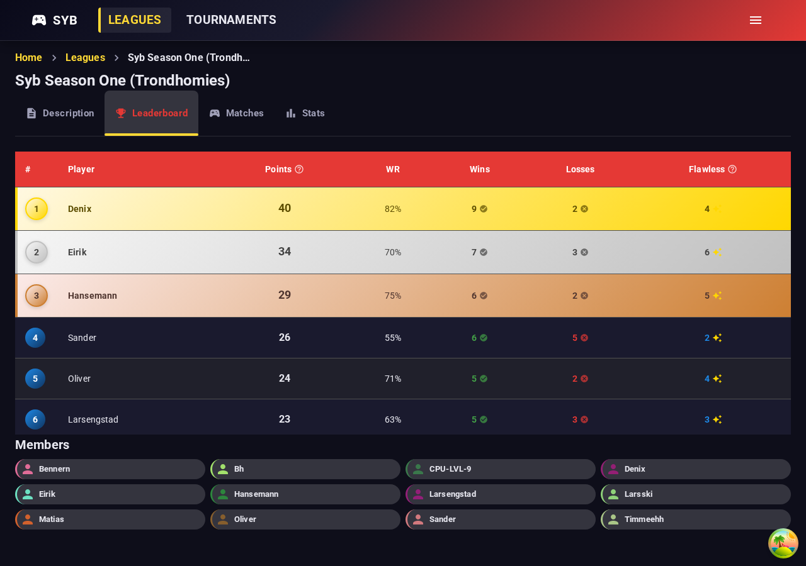
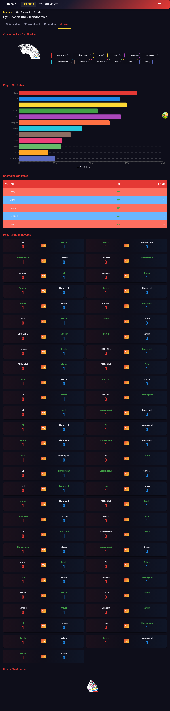
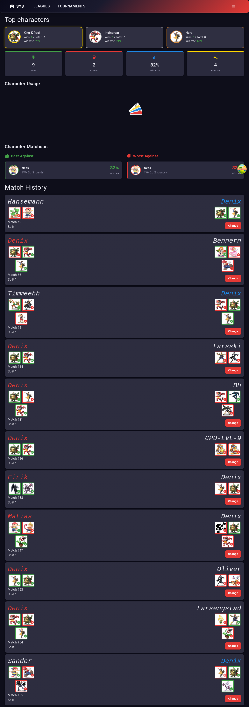

# SYB2.0 — Smash Your Boys Leaderboard

A Super Smash Bros league management system for tracking round-robin tournaments, match results, character statistics, and player rankings.

## Screenshots

### Leaderboard


### Character Stats


### Player Profile


## Tech Stack

**Backend** — .NET 9, MediatR (CQRS), EF Core 9, SQL Server, FluentValidation, AutoMapper, ASP.NET Core Identity (cookie auth)

**Frontend** — React 19, TypeScript, Vite 6, TanStack React Query 5, React Hook Form + Zod, Material UI 7, React Router 7

## Getting Started

```bash
# Start SQL Server
docker-compose up -d

# Run backend (HTTPS on port 5002)
dotnet run --project API

# Run frontend (port 3000, proxies /api to backend)
cd client && npm run dev
```

## Screenshots Script

Capture fresh screenshots of the running app:

```bash
cd e2e && npm run screenshots
```

Requires the backend and frontend to be running locally.
